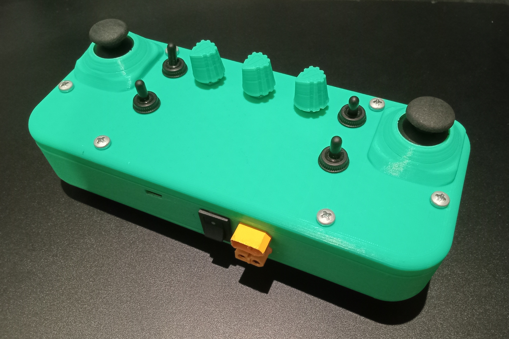
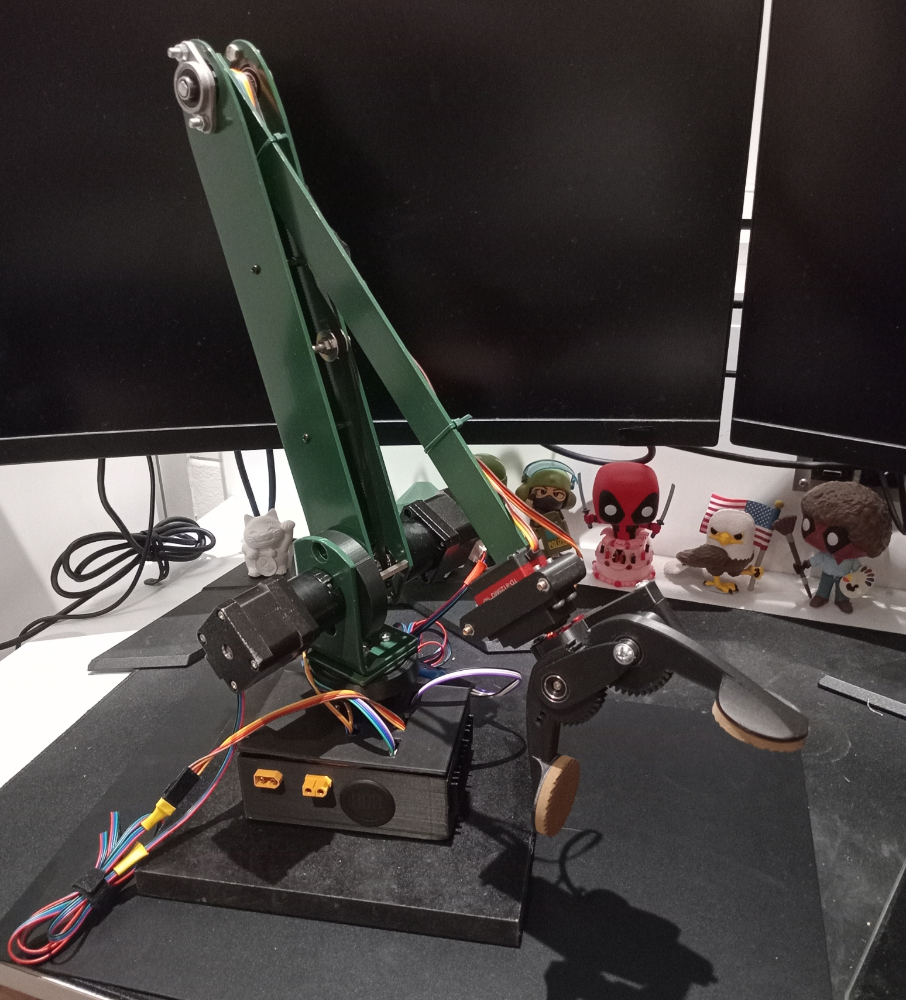
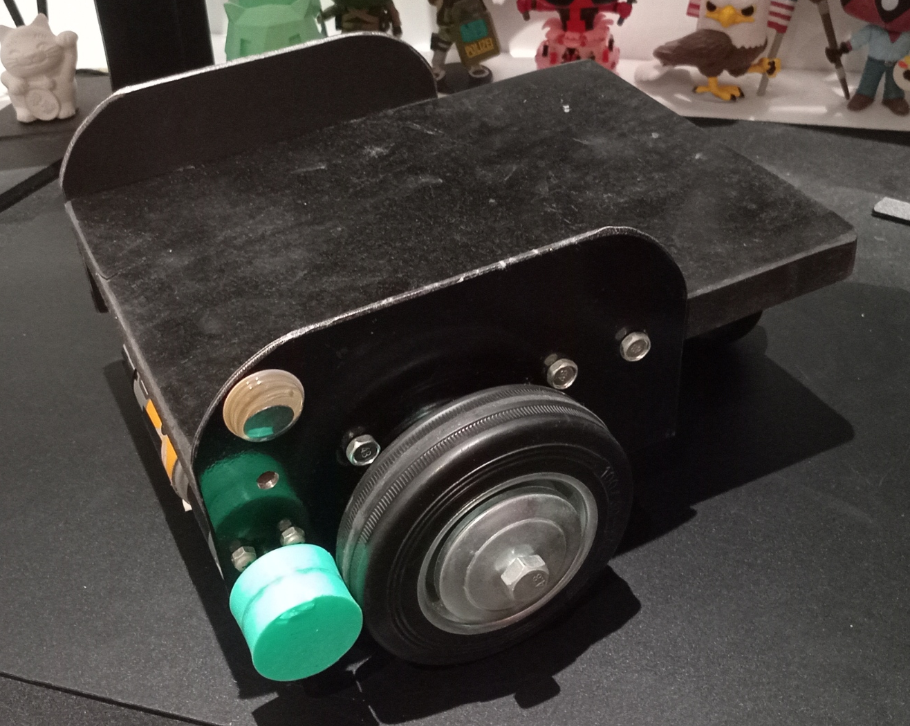

ESPnow Ecosystem
=======
* This Repository contains the code and documentation for controlling my robotics projects. I have built a controller, rover and arm. The idea of this project was to create an ecosystem in which all my projects use the same control scheme. This would allow me to use the same controller and or program to control all my current and future projects. It would also speed up my development process as I wouldn't have to start from nothing every time. 

Images
-----------

  
   
   

 
Controller
-----------
* I built the controller first. The first version of this was centred around an Arduino nano and 433 MHz radio. The radio was reliable and long-range i could control the rover from the other side of my house. However, the refresh rate left a lot to be desired. There was a noticeable delay between moving a joystick and the rover moving.
* This is why I upgraded to an ESP32. The built-in ESP-NOW protocol provided me with long-range, reliable and fast communication. The controller currently has 2 joysticks, 3 potentiometers, 2 toggle switches and 2 momentary switches. However, due to an oversight, the third potentiometer is not connected as there are too few analog pins. This is because the ESP32 has two analog digital converters ADC1 (8 pins) and ADC2 (10 pins). When wifi is enabled which is required for the ESP-NOW protocol ADC2 is disabled. Then of the 8 only 6 are available on my devboard. 

 Arm
-----------
* This is the second iteration of the robotic arm. The previous version was built from 3d printed PLA and carbon fibre rods. It suffered from a lack of power due to the limited gear ratios I could achieve with 6mm timing belts and matching gears. I needed a different way to gear down my motors. After some research, I found relatively cheap planetary gearboxes on Aliexpress.
* I then redesigned the arm to use these. I built the current arm from 3mm aluminium that I cut by hand and 3d printed PLA. The current arm uses 3 stepper motors (model no. 17HE15-1504S) for the 3 primary axis. The x-axis and secondary y-axis motors are geared down with a ratio of 1:13. The primary y-axis motor is geared down with a ratio of 1:13. 2 servo motors (TD-8125MG) control the rotation and opening/closing of the gripper. 

Rover
-----------
* This is the third iteration of the rover. The first version was not finished and was built from sheet metal with 3d printed PLA wheels. I found that it was difficult to align the wheels on the sheet metal.
* This resulted in the second iteration which was entirely 3d printed. The body was broken up into 4 parts as the whole body would not fit on my Ender 3v2's print bed. The 3d printed parts made it extremely easy to align everything as I could model holes and slots for everything to fit into. However, it also took a long time to print and PLA is expensive. The mechanical system for this iteration was also far too complicated which resulted in it only working once.
* I then redesigned the rover again resulting in the current iteration. The body is made from a sheet of 20mm MDF and the side panels are made from 3mm aluminium. I chose to use MDF as it was cheap and I could easily cut it accurately with a circular saw. I chose to use Aliuminum for the sides as it is easy to accurately drill, file and cut. I simplified the mechanical system for the current iteration. The motors drive a roller which is pushed against the wheel causing it to rotate. 

Software
-----------
* **Fusion 360** - I used Fusion 360 to model all the projects for both planning and 3d printing parts.
* **UltiMaker Cura** - I used UltiMaker Cura to slice all the models generated from Fusion 360 for 3d printing.
* **Arduino IDE** - I used the Arduino IDE along with the ESP32 library to write and upload all the code for the ESP32s.
* **GitHub** - I used Github to manage and easily transfer all the code for this project.

MAC addresses:
-----------
* Controller (1) C8:2E:18:F7:F5:40    (0xC8, 0x2E, 0x18, 0xF7, 0xF5, 0x40)
* Arm        (2) C8:2E:18:F7:AA:80    (0xC8, 0x2E, 0x18, 0xF7, 0xAA, 0x80)
* Rover      (4) 10:06:1C:82:A3:D4    (0x10, 0x06, 0x1C, 0x82, 0xA3, 0xD4)

* unassigned (3) C8:2E:18:F8:0A:8C
* unassigned (5) C8:2E:18:F8:07:CC

